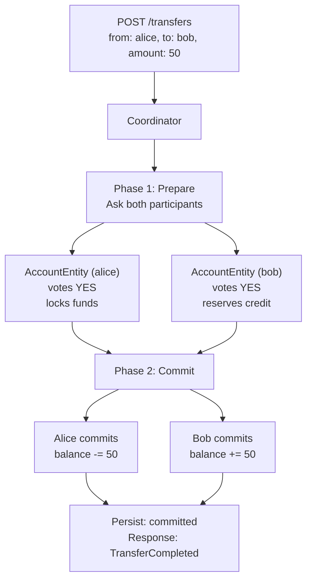
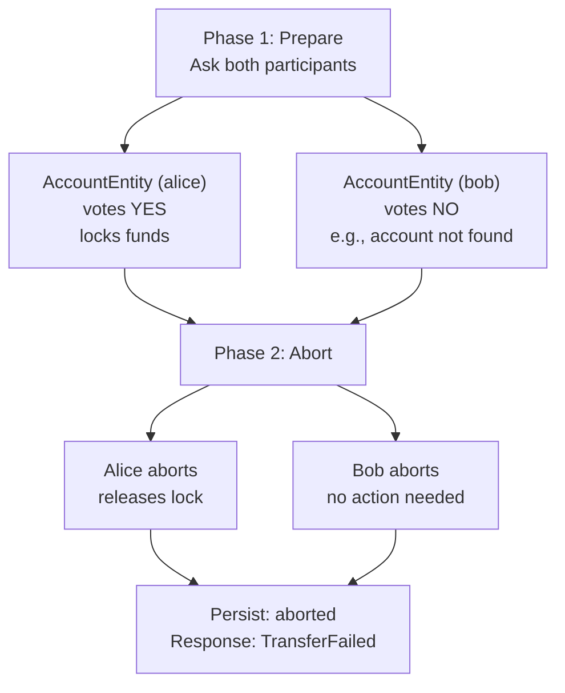

# 2 Phase Commit Pattern in the Money Transfer Application

This document explains the **goakt-2pc** application and how the 2 Phase Commit (2PC) pattern is used to implement reliable,
distributed money transfers across multiple account actors with atomic consistency.

## Application Overview

The application is a **money transfer service** that allows users to:

1. Create bank accounts with an initial balance
2. Transfer money between accounts
3. Query account balances and transfer status

Transfers are executed as **atomic distributed transactions** across two account actors (source and destination). Because each
account is an independent actor—potentially on different cluster nodes—we cannot use a traditional ACID transaction.
Instead, we use the **2 Phase Commit pattern** to achieve atomicity: either both accounts commit the changes, or neither does.

## Why the 2 Phase Commit Pattern?

In a traditional database, a transfer would be:

```sql
BEGIN;
  UPDATE accounts SET balance = balance - 100 WHERE id = 'alice';
  UPDATE accounts SET balance = balance + 100 WHERE id = 'bob';
COMMIT;
```

If any step fails, the entire transaction is rolled back automatically.

In a distributed actor system:

- **Alice** and **Bob** are separate actors, possibly on different nodes
- Each actor manages its own state independently
- There is no shared transaction coordinator by default
- A failure after modifying one account but not the other would leave the system in an **inconsistent state**

The 2 Phase Commit pattern solves this by:

1. **Phase 1 (Prepare/Vote)**: The coordinator asks all participants to prepare the transaction and vote on whether they can commit
2. **Phase 2 (Commit/Abort)**: If all participants vote YES, the coordinator tells everyone to commit. If any vote NO, everyone aborts.

This ensures atomicity: either all participants commit, or all abort. No partial state is ever visible.

## 2PC Flow in This Implementation

### Successful Transfer (All Participants Vote YES)



### Failed Transfer (Any Participant Votes NO) — Abort



### Failed Transfer (Insufficient Funds) — Immediate Abort

If the source account has insufficient funds during the prepare phase, it votes NO immediately. Both accounts abort, no locks are held, and the transfer is marked as aborted. The system remains consistent.

## Implementation Details

### Actors Involved

| Actor                | Role                                                                                           | Lifecycle                       |
|----------------------|------------------------------------------------------------------------------------------------|---------------------------------|
| **AccountEntity**    | Holds account balance. Handles `CreateAccount`, `Prepare`, `Commit`, `Abort`, `GetAccount`.    | One per account ID, long-lived  |
| **Coordinator**      | Coordinates the 2PC protocol. Manages Phase 1 (prepare/vote) and Phase 2 (commit/abort).       | One per transfer ID, long-lived |

### Two-Phase Execution

1. **Persist initial state**  
   Write transfer record with `status = preparing` to PostgreSQL. This allows recovery if the coordinator crashes.

2. **Phase 1: Prepare (Voting)**  
   `Ask` both `AccountEntity` actors with `PrepareTransfer`:
   - Each participant validates if it can perform the operation
   - If YES: participant locks the resources and votes YES
   - If NO: participant votes NO immediately
   - The coordinator collects all votes

3. **Phase 2: Commit or Abort**  
   - **If all YES**: Send `Commit` to all participants
     - Each participant applies the change and releases the lock
     - Mark transfer as `committed`
   - **If any NO**: Send `Abort` to all participants
     - Each participant releases any locks without applying changes
     - Mark transfer as `aborted`

4. **Persistence**  
   Transfer state is persisted after Phase 1 (prepared) and after Phase 2 (committed/aborted).

### State Persistence

- **Accounts**: Balance and `created_at` stored in `accounts` table.
- **Transfers**: `transfer_id`, `from_account_id`, `to_account_id`, `amount`, `status`, `reason`, timestamps in
  `transfers` table.

Status values: `preparing`, `prepared`, `committed`, `aborted`.

### Location Transparency

Account actors may live on any cluster node. The coordinator uses `ActorOf` to find them and `Ask` for
request–reply. GoAkt's cluster and remoting handle routing and serialization.

## Failure Scenarios

| Scenario                                          | Behavior                                                              |
|---------------------------------------------------|-----------------------------------------------------------------------|
| Insufficient funds during prepare                 | Source votes NO. Both abort. Transfer marked aborted.                 |
| Destination actor unreachable during prepare      | Destination votes NO. Both abort. Transfer marked aborted.            |
| Coordinator crash after Phase 1, before Phase 2   | Participants hold locks until timeout or coordinator recovers.        |
| Participant crash after voting YES                | On recovery, participant checks with coordinator to complete Phase 2. |
| Network partition during commit                   | Participants use timeout and inquiry protocol to determine outcome.   |

## Key Design Choices

1. **One coordinator per transfer** — Each transfer gets its own `Coordinator` (actor name = transfer ID). This
   isolates failures and allows parallel transfers.

2. **Synchronous protocol via Ask** — Both phases use `Ask` so the coordinator waits for responses. This keeps the
   protocol correct and simplifies state management.

3. **Resource locking during prepare** — Participants lock resources when voting YES to ensure they can commit later.
   Locks are released on commit or abort.

4. **Persistence at phase boundaries** — Transfer state is written at the start, after Phase 1 (prepared), and after
   Phase 2 (committed/aborted). This supports recovery and auditing.

5. **Timeout-based recovery** — If the coordinator fails, participants use timeouts and can inquire about the
   transaction outcome when the coordinator recovers.
