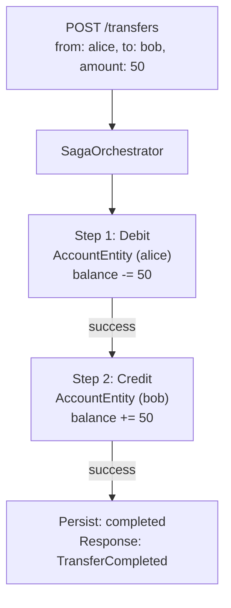
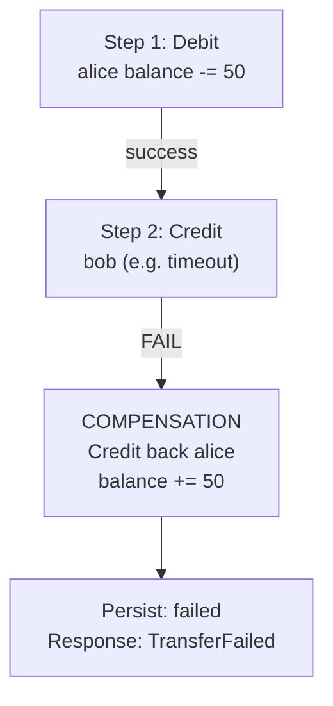

# Saga Pattern in the Money Transfer Application

This document explains the **goakt-saga** application and how the saga pattern is used to implement reliable,
distributed money transfers across multiple account actors.

## Application Overview

The application is a **money transfer service** that allows users to:

1. Create bank accounts with an initial balance
2. Transfer money between accounts
3. Query account balances and transfer status

Transfers are executed as **distributed transactions** across two account actors (source and destination). Because each
account is an independent actor—potentially on different cluster nodes—we cannot use a traditional ACID transaction.
Instead, we use the **saga pattern** to achieve eventual consistency with compensating actions on failure.

## Why the Saga Pattern?

In a traditional database, a transfer would be:

```sql
BEGIN;
  UPDATE accounts SET balance = balance - 100 WHERE id = 'alice';
  UPDATE accounts SET balance = balance + 100 WHERE id = 'bob';
COMMIT;
```

If the second update fails, the first is rolled back automatically.

In a distributed actor system:

- **Alice** and **Bob** are separate actors, possibly on different nodes
- Each actor manages its own state
- There is no shared transaction coordinator
- A failure after debiting Alice but before crediting Bob would leave Alice with less money and Bob unchanged—*
  *inconsistent state**

The saga pattern solves this by:

1. Breaking the transaction into **sequential steps**
2. Defining a **compensating action** for each step that can undo it
3. If any step fails, **running compensations in reverse order** to restore consistency

## Saga Flow in This Implementation

### Successful Transfer



### Failed Transfer (Step 2 Fails) — Compensation



### Failed Transfer (Step 1 Fails) — No Compensation Needed

If the debit fails (e.g. insufficient funds), nothing has been committed. We simply mark the transfer as failed and
return. No compensation is required.

## Implementation Details

### Actors Involved

| Actor                | Role                                                                                           | Lifecycle                       |
|----------------------|------------------------------------------------------------------------------------------------|---------------------------------|
| **AccountEntity**    | Holds account balance. Handles `CreateAccount`, `DebitAccount`, `CreditAccount`, `GetAccount`. | One per account ID, long-lived  |
| **SagaOrchestrator** | Coordinates the transfer. Executes steps in order, runs compensation on failure.               | One per transfer ID, long-lived |

### Step-by-Step Execution

1. **Persist initial state**  
   Write transfer record with `status = pending` to PostgreSQL. This allows recovery if the process crashes mid-saga.

2. **Step 1: Debit source**  
   `Ask` the source `AccountEntity` with `DebitAccount`.
    - If insufficient funds: respond with error, mark transfer failed, return.
    - If success: proceed to Step 2.

3. **Step 2: Credit destination**  
   `Ask` the destination `AccountEntity` with `CreditAccount`.
    - If success: mark transfer completed, persist, return `TransferCompleted`.
    - If failure: run compensation.

4. **Compensation**  
   Credit the source account with the same amount (undo the debit).  
   Mark transfer as `compensating`, then `failed`. Persist and return `TransferFailed`.

### State Persistence

- **Accounts**: Balance and `created_at` stored in `accounts` table.
- **Transfers**: `transfer_id`, `from_account_id`, `to_account_id`, `amount`, `status`, `reason`, timestamps in
  `transfers` table.

Status values: `pending`, `completed`, `failed`, `compensating`.

### Location Transparency

Account actors may live on any cluster node. The saga orchestrator uses `ActorOf` to find them and `Ask` for
request–reply. GoAkt’s cluster and remoting handle routing and serialization.

## Failure Scenarios

| Scenario                                 | Behavior                                                                     |
|------------------------------------------|------------------------------------------------------------------------------|
| Insufficient funds (debit fails)         | Transfer marked failed. No compensation.                                     |
| Destination actor unreachable            | Compensation: credit back source. Transfer failed.                           |
| Credit times out                         | Compensation: credit back source. Transfer failed.                           |
| Process crash after debit, before credit | Transfer stays `pending`. Manual reconciliation or retry logic can be added. |

## Key Design Choices

1. **One orchestrator per transfer** — Each transfer gets its own `SagaOrchestrator` (actor name = transfer ID). This
   isolates failures and allows parallel transfers.

2. **Synchronous steps via Ask** — Each step uses `Ask` so the orchestrator waits for the result before continuing. This
   keeps the flow simple and makes compensation straightforward.

3. **Persistence at key points** — Transfer state is written before execution, after completion, and after failure. This
   supports auditing and future recovery.

4. **Compensation is best-effort** — If the compensating credit fails (e.g. node down), we still mark the transfer as
   failed. Operational monitoring and manual reconciliation may be needed in production.
