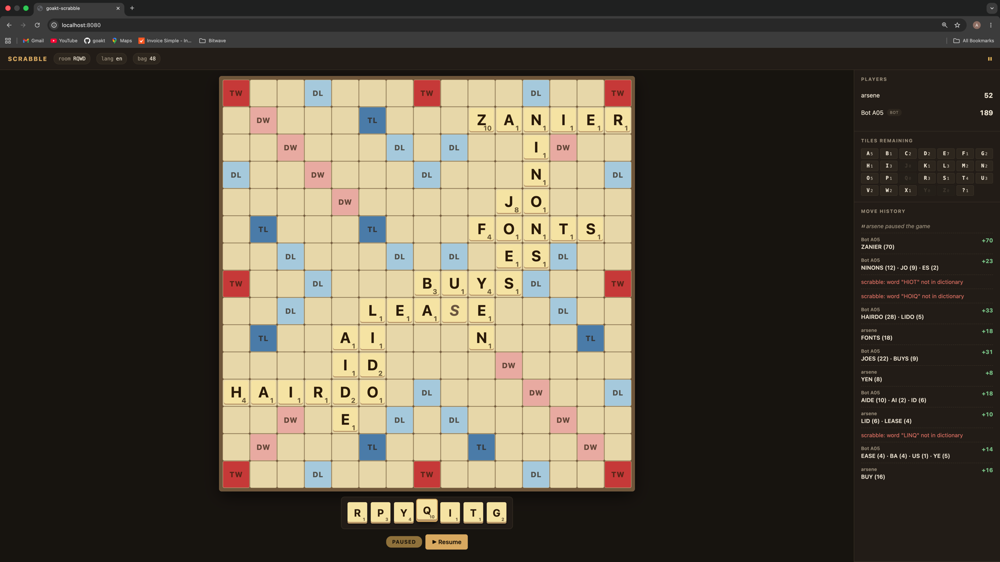

# goakt-scrabble

A browser-playable, real-time multiplayer **Scrabble** game built on
[GoAkt](https://github.com/Tochemey/goakt). Each room is a turn-based
`RoomActor` with full Scrabble rules, an Appel/Jacobson DAWG move
generator behind bot opponents, and the bundled 172,823-word ENABLE
dictionary. 2–4 players (humans and/or bots) per game. See
[DESIGN.md](DESIGN.md) for the architecture deep dive.



*A paused human-vs-bot game: classic Scrabble premium-square colours
and cream wooden tiles centred on a dark frame; the right pane tracks
live scores, every letter still unseen (bag + opponents' racks), and
the full move history including the bot's bingo ZANIER (70 pts) and
the times the bot tried words not in the dictionary.*

---

## Status

| Phase | Status     | What's in it                                                                        |
|------:|------------|-------------------------------------------------------------------------------------|
|     1 | ✅ complete | Pure-Go engine + bot, fully unit-tested (38 tests)                                  |
|     2 | ✅ complete | Actor layer, WebSocket gateway, vanilla-TS browser client; single-node              |
|     3 | ✅ complete | Drag-and-drop tile placement; pointer events (mouse + touch)                        |
|     4 | ✅ complete | Multi-stage `Dockerfile` + 3-node kind cluster behind nginx ingress (`make k8s-up`) |

English only. The bundled dictionary (`dict/en.txt`) is the full
**172,823-word ENABLE word list** (public domain — used by Words with
Friends), so casual play should "just work." See
[Dictionary](#dictionary) for swapping in TWL or SOWPODS for
tournament-grade play.

---

## What GoAkt features it shows

| Feature                                                             | Where it lives                                    |
|---------------------------------------------------------------------|---------------------------------------------------|
| `SpawnSingleton` — one-instance-per-cluster control plane           | `LobbyActor` in `lobby.go`                        |
| `SpawnOn` + `WithPlacement(LeastLoad)` + `WithRelocationDisabled`   | `LobbyActor.handleJoinOrCreate`                   |
| `Become` / `UnBecome` FSM (waiting → playing → gameOver)            | `RoomActor` behaviors in `room.go`                |
| `ScheduleOnce` for turn / shutdown / delayed-bot-move timers        | `RoomActor.schedule`, `scheduleBotMove`           |
| Pub/Sub `TopicActor` — one topic per room, fan-out to N players     | `room.go::publish`, `session.go::PostStart`       |
| Grains (virtual actors) for persistent player profiles              | `PlayerProfileGrain` in `profile.go`              |
| CRDT `PNCounter` for the cluster-wide per-player wins               | `Leaderboard` in `leaderboard.go`                 |
| Watch / `*actor.Terminated` for ungraceful session cleanup          | `RoomActor.waitingBehavior` and `playingBehavior` |
| Cluster-aware `ActorOf` for cross-node room lookup                  | `gateway.go::resolveRoom`                         |
| CBOR serializers registered for every cross-node message type       | `main.go::buildActorSystem`                       |
| System Extensions for shared per-process state (DAWGs, leaderboard) | `registry.go`, `leaderboard.go`, `profile.go`     |
| Child actors per bot, with `Tell(parent)` for the bot's reply       | `BotActor` in `bot.go`                            |

---

## Architecture

```
        Browser (TS, SVG board + click-to-place)
                          │
                          │  WebSocket  /ws?name=…&room=ABCD&lang=en
                          ▼
  ┌──────────────────────────────────────────────────────────────┐
  │  Node  (one Go binary per machine)                           │
  │                                                              │
  │   PlayerSessionActor  ──subscribes──►  Topic: room.<code>    │
  │   (one per WS conn)                            ▲             │
  │           │ Tell                               │ Publish     │
  │           ▼                                    │             │
  │   ┌────────────────────┐              ┌────────┴─────────┐   │
  │   │ LobbyActor         │  SpawnOn     │ RoomActor        │   │
  │   │ (cluster singleton)│ ───────────► │ FSM via Become   │   │
  │   └────────────────────┘  (LeastLoad) │ + child BotActors│   │
  │                                       │ + Bag/Board/DAWG │   │
  │   PlayerProfileGrain                  └──────────────────┘   │
  │   (one per player ID)                                        │
  │                                                              │
  │   Leaderboard CRDT — PNCounter keyed by player ID            │
  └──────────────────────────────────────────────────────────────┘
```

The `RoomActor` FSM has three behaviors (a `pausedBehavior` sits as a
sub-state of `playing`, reached via `Become` on a Pause message):

```
   ┌─────────────┐
   │   waiting   │   accept Join + AddBot/RemoveBot/Start (owner)
   └──────┬──────┘
          │ Start → startGame
          ▼
   ┌─────────────┐   ScheduleOnce(90s, turnTimeout) per turn
   │   playing   │   accept Place / Exchange / Pass / Pause
   │             │   on Place: Move.Validate → apply → advance turn
   │             │   on bot turn: ScheduleOnce(700ms, YourTurn) → bot child
   │             │   on 6 scoreless turns OR (bag empty + a rack empty)
   └──────┬──────┘
          │ end-of-game detected
          ▼
   ┌─────────────┐   apply end-of-game rack penalty + out-bonus
   │  gameOver   │   increment winner's PNCounter (cluster CRDT)
   │             │   ScheduleOnce(30s, Shutdown); accept PlayAgain
   └─────────────┘
```

Invalid placements (wrong direction, off-line, not touching existing
tiles, formed word not in dictionary, blank without chosen letter, …)
are rejected immediately at `Place` time — there is no separate
challenge phase. This matches the "Full ruleset (auto-reject)" option
described in DESIGN.md.

---

## Quick start

The app is Kubernetes-only — peer discovery hits the in-cluster
Kubernetes API, so the binary won't start outside a cluster. The
one-shot flow is:

```bash
make k8s-up           # kind cluster + nginx ingress + image build + deploy
```

Open <http://localhost>. A join dialog asks for your name and an
optional room code; submit it and you land in a fresh room (or the
room you typed). Share the URL (or the room code shown in the header)
with a friend, or click **+ Add Bot** + **Start** to play against a
bot.

The browser hits a single endpoint and knows nothing about
clustering. Behind the ingress sit three goakt nodes
sharing the same actor system; the room you join may be hosted on
*any* of them, and `PlayerSessionActor`s on a different pod reach it
transparently via the goakt cluster.

```
Browser
   │  one HTTP/WS endpoint
   ▼
NGINX Ingress (control-plane, hostPort 80)
   │  affinity cookie — pins each browser's *next* HTTP request
   │  (reconnect, page reload) back to its previous pod
   ▼
scrabble Service (ClusterIP)
   │
   ▼
scrabble-0     scrabble-1     scrabble-2     ← StatefulSet, one pod per worker
    └───────────────┬──────────────┘
                    │ goakt cluster gossip (9000 / 9001 / 9002)
                    │ peers discovered via the Kubernetes API
                    │ (pod label app=scrabble); remoting traffic
                    │ uses the headless-service per-pod DNS
```

The kind cluster has 1 control-plane + 3 workers; pod-anti-affinity
spreads the three replicas one-per-worker so a node failure takes out
at most one cluster member. `make k8s-status` prints pods / services /
ingress / endpoints; `make k8s-logs` tails every pod's log with a name
prefix; `make k8s-down` removes everything (cluster included).

---

## Ports

| Purpose                              | Default | Configurable via   |
|--------------------------------------|---------|--------------------|
| HTTP / WebSocket (browser-facing)    | `8080`  | `--http-port`      |
| Remote actor gRPC (inter-node Tells) | `9000`  | `--remoting-port`  |
| Cluster gossip (discovery)           | `9001`  | `--discovery-port` |
| Cluster peer state-sync              | `9002`  | `--peers-port`     |

Discovery uses goakt's `discovery/kubernetes` provider: each pod lists
its siblings via the Kubernetes API by the `app=scrabble` label, then
reads the named container ports (`discovery`, `remoting`, `peers`)
from the pod spec. Configure with `--namespace` (defaults to
`$POD_NAMESPACE`) and `--app-label`. `make build` is available for
local type-checking, but the resulting binary requires the in-cluster
Kubernetes API to start and will not run outside a cluster.

### Profile store

`PlayerProfileGrain` (per-player stats: name, games played, wins,
total score) is backed by one of two stores, selected at startup:

| Backend       | When                                       | Persistence                                                                  |
|---------------|--------------------------------------------|------------------------------------------------------------------------------|
| **Postgres**  | `--database-url` or `$DATABASE_URL` is set | Shared across all pods; survives restarts. Schema is auto-migrated on boot.  |
| **In-memory** | Neither flag nor env var is set            | Per-pod map; profile data is lost on pod restart and isn't shared cross-pod. |

`make k8s-up` brings up a bundled Postgres StatefulSet
(`postgres:18-alpine`, single replica + PVC, see `k8s/postgres.yaml`)
and injects `DATABASE_URL` from the `scrabble-postgres` Secret. An
initContainer on each scrabble pod waits for `pg_isready` before the
main container starts. The bundled Postgres is sized for a demo;
swap in a managed instance / external Secret for any real deployment.

---

## Game rules

### Goal

Score the most points across one game. The game ends when the bag is
empty and one player has emptied their rack (or after six consecutive
scoreless turns), at which point the end-of-game rack penalty and
out-bonus are applied.

### Players

A room holds **2–4 players**, any mix of humans and bots. Below 2 the
room sits in the *waiting* phase. The first player to join is the
room's **owner** and is the only one who can Add/Remove bots and
press **Start Game**.

### Turn structure

On each turn the current player chooses one action and ends their turn:

| Action       | What it does                                                                                                                                                               |
|--------------|----------------------------------------------------------------------------------------------------------------------------------------------------------------------------|
| **Place**    | Place 1–7 tiles in a single row or column, forming valid words; the move is scored and committed.                                                                          |
| **Exchange** | Swap any number of rack tiles for fresh ones from the bag (requires ≥ 7 tiles in the bag).                                                                                 |
| **Pass**     | End your turn without placing or exchanging.                                                                                                                               |
| **Pause**    | Freeze the turn clock and any bot move; the remaining seconds are saved for whenever someone resumes. Any player at the table can pause and resume — courtesy, not a role. |

Each turn has a 90-second clock; on timeout it's treated as a pass.

### Placement validity

A `Place` is rejected (with an in-game `error` message) if any of these
fails:

- All placed tiles must lie on a single row OR a single column.
- The placement must be contiguous — no gaps (existing tiles between
  placements are fine; empty squares between placements are not).
- On the **first move** of the game, the placement must cover the
  centre square.
- On every subsequent move, the new tiles must connect to at least one
  existing tile on the board.
- Every word formed (main word + every cross-word of length ≥ 2) must
  appear in the language's dictionary.
- Blank tiles must have a chosen letter at placement time.

### Scoring

- **Tile values** are the standard English Scrabble values
  (A/E/I/L/N/O/R/S/T/U = 1, D/G = 2, B/C/M/P = 3, F/H/V/W/Y = 4,
  K = 5, J/X = 8, Q/Z = 10).
- **Premium squares** (DL/TL/DW/TW) apply *only* to tiles being newly
  placed *this turn* — once a tile is on the square the bonus is spent.
- **Blanks** score 0 but otherwise behave as their chosen letter,
  including triggering DW/TW word multipliers.
- **Bingo bonus**: +50 for placing all 7 rack tiles on one turn.
- **End-of-game**: each player loses the sum of the point values of
  the tiles remaining on their rack. If exactly one player has emptied
  their rack ("gone out"), they gain the sum of every other player's
  remaining rack value.

### Bots

Bots use the engine's Appel/Jacobson DAWG move generator: enumerate
every legal placement, pick the highest-scoring one, with a small (700
ms) "thinking" delay so the move doesn't appear instantly. Bots pass
if no legal placement exists.

### Play again

The game-over overlay has a **Play Again** button. The first player to
click it (during the 30-second shutdown window) resets the board,
scores and drawer rotation, and starts a fresh game in the same room
with the same players. If nobody clicks within 30 seconds the room
shuts down and returning players get a fresh code.

---

## Controls

Two ways to move tiles around — drag-and-drop is primary; click-to-place
is the same keystrokes-fewer fallback.

| Action                             | How                                                                                   |
|------------------------------------|---------------------------------------------------------------------------------------|
| Place a tile (drag)                | Press on a rack tile and drag it onto an empty board square; release to drop.         |
| Place a tile (click)               | Click a rack tile (it lifts with a gold outline), then click an empty board square.   |
| Move a tile placed this turn       | Drag the gold-bordered tile from one board square to another empty square.            |
| Recall one tile to the rack        | Drag the gold-bordered tile back onto the rack, or click it on the board.             |
| Recall all pending tiles           | Click **Recall**.                                                                     |
| Shuffle your rack                  | Click **Shuffle** (visual only — doesn't change what you hold).                       |
| Submit your placement              | Click **Submit**.                                                                     |
| Exchange tiles                     | Click **Exchange**, click rack tiles to mark (red ring + ↻ badge), click **Confirm**. |
| Pass your turn                     | Click **Pass**.                                                                       |
| Pause / Resume                     | Click **⏸ Pause** during your or anyone else's turn; click **▶ Resume** to continue.  |
| Play another game (game-over only) | Click **Play Again**.                                                                 |

Blank tiles display as **`?`** in the rack. When you drop one onto the
board, a 26-letter picker opens; tap your choice and it commits. Once
placed, the blank shows the chosen letter in italic with no point pip.

Drag-and-drop uses pointer events, so the same gestures work on mouse,
trackpad, and touch screens.

## Side panel

The right pane is read-only and always reflects the live game state:

- **Players** — name, score, tiles remaining, bot tag, with the current
  turn highlighted by an accent bar.
- **Tiles remaining** — a 7×4 grid showing how many copies of each
  letter (and blank) are still *unseen* to you — that is, in the bag
  plus your opponents' racks. The same information serious players
  track on paper.
- **Move history** — newest first: who played, the word(s) formed with
  per-word score, a **BINGO** badge for 7-tile plays, and the total
  delta. Server events (room reset, errors) appear here too as italic
  lines.

The most recent opponent placement glows gold on the board for ~6
seconds so you immediately see what changed when it becomes your turn.

---

## Dictionary

The bundled `dict/en.txt` is the **ENABLE word list** (172,823 words,
public domain — the same list Words with Friends uses). It's enough
for casual play out of the box; PLAN, PLANS, PLACE, HORSE, QI, ZA and
the other common Scrabble play words are all present.

For **tournament-grade play** you'll want a commercially-licensed list
(TWL in North America, SOWPODS / CSW internationally). Drop the file
into `dict/en.txt` (one word per line, lines starting with `#` are
treated as comments) and rebuild + redeploy:

```bash
make image-load deploy   # rebuild image, reload into kind, roll out
```

| Source                                                                                   | Size | License                             | Notes                                                    |
|------------------------------------------------------------------------------------------|------|-------------------------------------|----------------------------------------------------------|
| [ENABLE](https://github.com/dolph/dictionary)                                            | 172k | public domain                       | **Bundled**. Used by Words with Friends                  |
| [SOWPODS / Collins Scrabble Words](https://en.wikipedia.org/wiki/Collins_Scrabble_Words) | 280k | commercial (Collins)                | International tournament list — do **not** redistribute  |
| [TWL06](https://en.wikipedia.org/wiki/Tournament_Word_List)                              | 178k | commercial (Hasbro/Merriam-Webster) | North American tournament list — do **not** redistribute |

Words shorter than 2 letters and words containing characters not in
the language's alphabet are skipped silently at load time.

---

## Code layout

| File             | Responsibility                                                                                                                       |
|------------------|--------------------------------------------------------------------------------------------------------------------------------------|
| `scrabble/`      | Pure-Go engine package — bag, board, rack, DAWG, move validator/scorer, end-of-game, bot move generator                              |
| `types.go`       | Wire protocol (browser ↔ session) + cross-node actor messages + scheduled-message types                                              |
| `registry.go`    | `Registry` extension — per-language Language + DAWG bundles, fetched by actors via `ctx.Extension(…)`                                |
| `lobby.go`       | `LobbyActor` cluster singleton — room directory, `SpawnOn(LeastLoad)` for new rooms                                                  |
| `room.go`        | `RoomActor` — FSM via `Become`, turn timer, Place/Exchange/Pass, bot turn dispatch, end-game scoring                                 |
| `bot.go`         | `BotActor` — child of RoomActor; wraps `scrabble.BestMove`; converts wire ⇄ engine board/rack                                        |
| `wire.go`        | Helpers for board/rack ⇄ string-grid and placement-wire ⇄ engine-placement                                                           |
| `session.go`     | `PlayerSessionActor` — owns the `*websocket.Conn`, subscribes to room topic, encodes outbound events to JSON                         |
| `gateway.go`     | WS upgrade, lobby Ask, exponential-backoff room PID resolution, per-connection session spawn, reader loop                            |
| `profile.go`     | `PlayerProfileGrain` — persistent stats per player id                                                                                |
| `leaderboard.go` | `Leaderboard` extension — CRDT `PNCounter` per player for wins                                                                       |
| `main.go`        | Flag parsing, dictionary load, actor-system bootstrap, HTTP server                                                                   |
| `web/index.html` | Boot HTML + CSS; loads `main.js`                                                                                                     |
| `web/main.ts`    | TypeScript source for the browser client; the wire shapes mirror `types.go`                                                          |
| `web/main.js`    | Build artifact (gitignored). Generated by `make web`                                                                                 |
| `dict/en.txt`    | Bundled English wordlist — ENABLE, public domain (see [Dictionary](#dictionary) above)                                               |
| `tsconfig.json`  | TS compiler config (ES2020, strict, in-place compile inside `web/`)                                                                  |
| `Dockerfile`     | Multi-stage build: tsc → static Go → distroless runtime (~20 MB final image)                                                         |
| `kind/`          | `cluster.yaml` — 1 control-plane + 3 workers; control-plane exposes `:80` and runs the ingress controller                            |
| `k8s/`           | Kubernetes manifests: namespace, RBAC, Postgres + scrabble StatefulSets, headless + ClusterIP services, NGINX ingress, kustomization |
| `Makefile`       | `make help` for the full list. Compile, Docker image build/load, kind cluster + ingress, kustomize deploy, log/status helpers        |
| `DESIGN.md`      | Architecture deep dive, FSM details, phased build plan, deployment notes                                                             |

---

## License

MIT, same as the rest of the goakt-examples repo.
